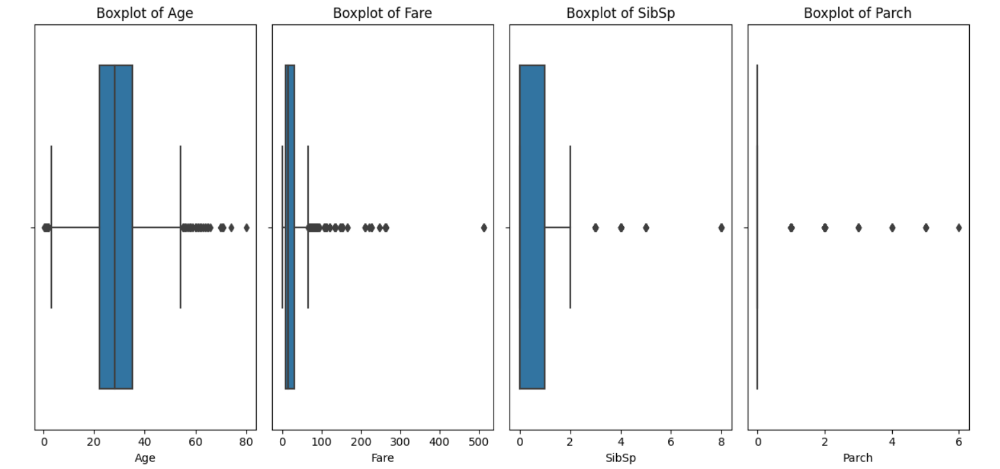
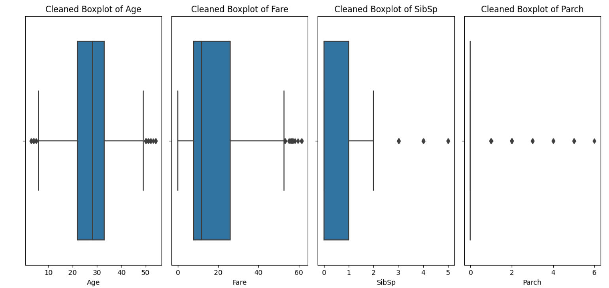

# 🚢 Titanic Data Preprocessing
This project is part of an AI & ML internship task focused on **data cleaning and preprocessing** using the Titanic dataset.

## 📂 Dataset
- Source: [Kaggle-Titanic Dataset](https://www.kaggle.com/datasets/yasserh/titanic-dataset)
- File used: `titanic-dataset.csv`

## ✅ Task Objectives
- Load and explore the dataset
- Handle missing values using median/mode imputation
- Encode categorical variables
- Normalize and standardize numerical features
- Visualize and remove outliers using boxplots and IQR method

## 🧠 Key Concepts Applied
- Missing value handling
- Label encoding & one-hot encoding
- Feature scaling (Min-Max & Standardization)
- Outlier detection and removal
- Data visualization with Seaborn and Matplotlib

## 🛠️ Tools & Libraries
- Python
- Pandas
- NumPy
- Seaborn
- Matplotlib
- Scikit-learn

## 📊 Results
- Cleaned dataset with no missing values
- Categorical features converted into numerical form
- Features scaled using both normalization and standardization
- Outliers removed from `Age` and `Fare` using IQR method

## 🔍 Step-by-Step Breakdown

### 🧾 1. Data Loading & Exploration

- Loaded the Titanic dataset using Pandas.
- Displayed the first few rows and dataset shape.
- Inspected column data types and checked for null values.
- Calculated null value percentages for informed decision-making.

### 🧼 2. Handling Missing Values

- Imputed missing **Age** values using the **median**.
- Imputed missing **Embarked** values using the **mode**.
- Dropped the **Cabin** column due to excessive missing values.

### 🧠 3. Encoding Categorical Features

- Encoded **Sex** as binary using label encoding (`male`: 0, `female`: 1).
- Applied **one-hot encoding** on the **Embarked** column with `drop_first=True` to avoid the dummy variable trap.

### ⚖️ 4. Feature Scaling

- Applied two scaling techniques for demonstration:
  - **Min-Max Scaling** using `MinMaxScaler` (scales values between 0 and 1).
  - **Standardization** using `StandardScaler` (zero mean, unit variance).
- Scaled numerical features: `Age`, `Fare`, `SibSp`, `Parch`.

### 📊 5. Outlier Detection & Removal

- Visualized outliers using **boxplots** for all numerical columns.
- Removed outliers in **Age** and **Fare** using the **IQR method**.
- Displayed updated dataset shape and re-plotted cleaned boxplots.

## 📉 Boxplots for Outlier Detection

### 🔹 Before Outlier Removal

### 🔹 After Outlier Removal

